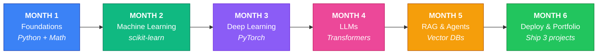
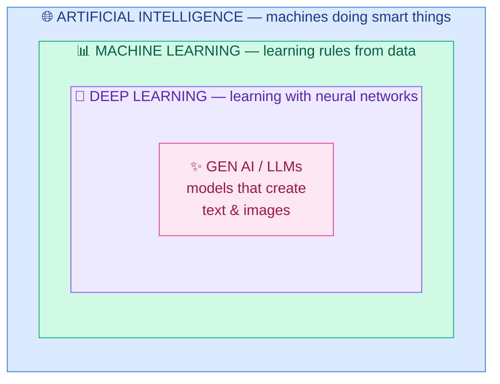
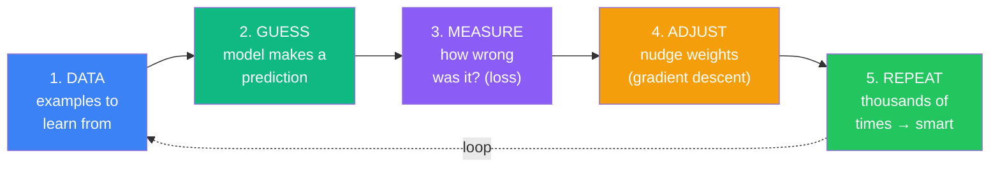
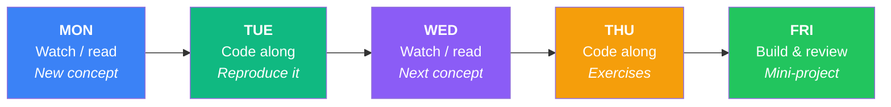
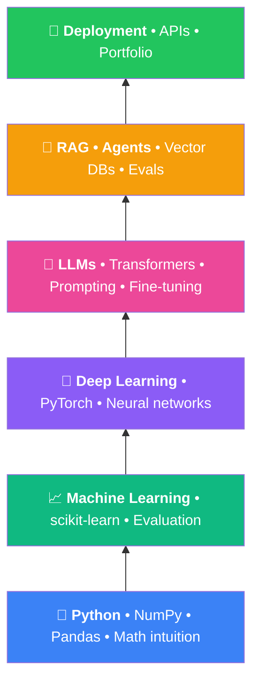
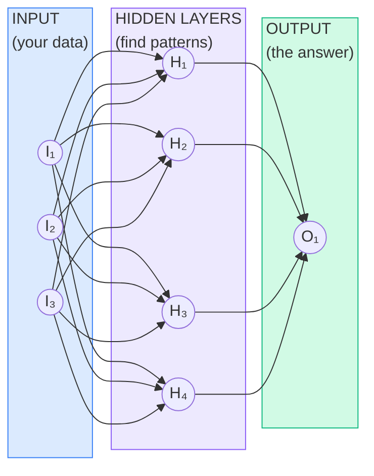
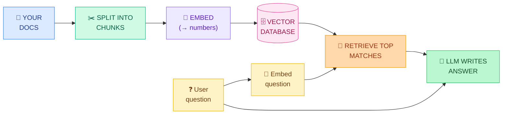

# ai-journey

My 6-month journey from Python to shipping production AI systems — following [The 6-Month AI Engineer Roadmap](roadmap.pdf).

**Foundations → Machine Learning → Deep Learning → LLMs → RAG & Agents → Deployment**



| 26 weeks | 5 days/week | 1–2 hrs/day | ~200 total hours | 3 portfolio projects |
|---|---|---|---|---|

> *"You do not need to be great to start. You need to start to become great."*

---

## First: what even is AI?

Before any course, get the big picture. "AI", "ML", "deep learning", and "LLMs" are not the same thing — they are circles inside circles:



### The training loop *is* machine learning



### Beginner dictionary

| Term | What it means (no jargon) |
|---|---|
| **Model** | The "brain": a math function with millions of adjustable numbers (weights) that turns input into output. |
| **Training** | Showing the model many examples and adjusting its weights until its guesses become good. |
| **Dataset** | The collection of examples used for training. Data quality matters more than fancy algorithms. |
| **Neural network** | A model built from layers of simple units. "Deep learning" just means many layers. |
| **LLM** | A giant neural network trained on huge amounts of text to predict the next word. GPT and Claude are LLMs. |
| **Token** | A piece of a word. LLMs read and write tokens, not letters. |
| **Prompt** | The instruction you give an LLM. Writing good prompts is a real engineering skill. |
| **Embedding** | Turning text into a list of numbers so a computer can measure "meaning similarity". |
| **RAG** | Retrieval-Augmented Generation: letting an LLM look up YOUR documents before answering. |
| **Agent** | An LLM in a loop that can use tools (search, code, APIs) to complete multi-step tasks. |
| **Fine-tuning** | Taking a trained model and training it a little more on your own examples to specialize it. |
| **Inference** | Using a trained model to get answers. Training = school; inference = the job. |

---

## How this roadmap works

Three rules: **consistency beats intensity** · **build more than you watch** · **done beats perfect**.

### Weekly rhythm



Weekends fully off.

### The learning stack

Each layer builds on the one below — do not skip levels.



---

## 🔵 Phase 1 — Foundations: Python & Math for AI
**Weeks 1–4 · ~30–35 hours · Month 1**

Goal: write Python confidently for data work (NumPy, Pandas, charts) and build visual intuition for the math behind AI.

| Wk | Topic | Resource | Complete this |
|---|---|---|---|
| 1 | Python for data work | [Kaggle Learn – Python](https://kaggle.com/learn/python) | All 7 lessons + exercises · VS Code + Jupyter installed · GitHub repo created |
| 2 | NumPy, Pandas, Matplotlib | [Kaggle Learn – Pandas](https://kaggle.com/learn/pandas) · [W3Schools NumPy](https://w3schools.com/python/numpy) | All 6 Pandas lessons · NumPy Intro → Array Slicing · Analyze 1 CSV: 10 questions, 5 charts |
| 3 | Linear algebra (visual) | [3Blue1Brown – Essence of Linear Algebra](https://3blue1brown.com/topics/linear-algebra) | Videos 1–7 · Recreate dot product + matrix transform in NumPy · 1-page notes |
| 4 | Calculus + statistics intuition | [3Blue1Brown Calculus](https://3blue1brown.com/topics/calculus) · [StatQuest](https://youtube.com/@statquest) | 4 calculus videos + 6 StatQuest videos · Code gradient descent from scratch (20 lines) |

**Easy mode:** [W3Schools Python](https://w3schools.com/python) · [NumPy](https://w3schools.com/python/numpy) · [Pandas](https://w3schools.com/python/pandas) · [Matplotlib](https://w3schools.com/python/matplotlib_intro.asp)

### 🎯 Milestone project — Data Explorer Notebook
Pick a Kaggle dataset. One polished notebook: load → clean → explore → visualize → 5 insights in plain English.

### ✅ Checkpoint
- [ ] Write a Python function and class without looking anything up
- [ ] Explain what matrix multiplication does to a vector
- [ ] Answer questions about a CSV using Pandas groupby and filtering
- [ ] Explain gradient descent in one sentence

---

## 🟢 Phase 2 — Machine Learning Fundamentals
**Weeks 5–8 · ~32–36 hours · Month 2**

Goal: understand how machines learn from data, train real models with scikit-learn, and evaluate them honestly.

| Wk | Topic | Resource | Complete this |
|---|---|---|---|
| 5 | ML basics, regression, classification | [Microsoft ML-For-Beginners](https://github.com/microsoft/ML-For-Beginners) · [Google ML Crash Course](https://developers.google.com/machine-learning/crash-course) | Intro (1–4) + Regression (5–8) · Train linear + logistic regression |
| 6 | Trees, forests, gradient boosting | [Kaggle Intro to ML](https://kaggle.com/learn/intro-to-machine-learning) · [Intermediate ML](https://kaggle.com/learn/intermediate-machine-learning) | Both courses · Enter Kaggle Titanic, submit a score |
| 7 | Evaluation, overfitting, ROC | [StatQuest ML playlist](https://youtube.com/@statquest) · [scikit-learn User Guide](https://scikit-learn.org/stable/user_guide.html) | 8 StatQuest videos · Improve Titanic with CV + feature engineering |
| 8 | Clustering, PCA, end-to-end workflow | [ML-For-Beginners Clustering](https://github.com/microsoft/ML-For-Beginners) · [Andrew Ng ML Specialization (audit)](https://coursera.org/specializations/machine-learning-introduction) | Clustering lessons + quiz · Full pipeline on Kaggle House Prices |

**Easy mode:** [W3Schools ML](https://w3schools.com/python/python_ml_getting_started.asp) · [W3Schools AI](https://w3schools.com/ai)

### 🎯 Milestone project — End-to-End ML Project
Clean data, 2+ models compared, honest cross-validated evaluation, README explaining every choice. Post on LinkedIn.

### ✅ Checkpoint
- [ ] Explain overfitting and two ways to fight it
- [ ] Choose precision vs recall for a business case and justify it
- [ ] Train, tune, and compare two models without a tutorial
- [ ] Score in the top half of the Titanic leaderboard

---

## 🟣 Phase 3 — Deep Learning & PyTorch
**Weeks 9–13 · ~40–45 hours · Month 3**

Goal: understand neural networks deeply enough to build one from scratch, then use PyTorch fluently. **Type every line yourself.**

Every LLM is a neural network like this — just enormously bigger:



| Wk | Topic | Resource | Complete this |
|---|---|---|---|
| 9 | What a neural network *is* | [3Blue1Brown Neural Networks](https://3blue1brown.com/topics/neural-networks) · [Microsoft AI-For-Beginners](https://github.com/microsoft/AI-For-Beginners) | All 4 core videos, twice · Trace one forward pass by hand |
| 10 | Backprop from scratch (micrograd) | [Karpathy Zero to Hero, video 1](https://karpathy.ai/zero-to-hero.html) | Full video typing along · Do the exercises |
| 11 | PyTorch tensors, autograd, training loop | [learnpytorch.io](https://learnpytorch.io) · [PyTorch tutorials](https://docs.pytorch.org/tutorials) | Chapters 00–03 · Train an MNIST classifier in Colab |
| 12 | CNNs + transfer learning | [fast.ai Practical DL](https://course.fast.ai) | Lessons 1–2 + notebooks · Fine-tune a pretrained model |
| 13 | Language begins (makemore) | [Karpathy Zero to Hero, videos 2–3](https://karpathy.ai/zero-to-hero.html) | Both videos typing along · Train makemore, generate names |

**Easy mode:** [W3Schools AI – Neural Networks](https://w3schools.com/ai/ai_neural_networks.asp) · [TensorFlow Playground](https://playground.tensorflow.org)

### 🎯 Milestone project — Image Classifier + Tiny Language Model
Fine-tuned image classifier with demo GIF + character-level LM with sample generations.

### ✅ Checkpoint
- [ ] Tell the backprop story (chain rule + gradient downhill)
- [ ] Write a PyTorch training loop from memory
- [ ] Explain embeddings
- [ ] Explain transfer learning

---

## 🌸 Phase 4 — LLMs & Transformers
**Weeks 14–17 · ~32–36 hours · Month 4**

Goal: understand how GPT-class models actually work (you will build one), then get fluent with the modern LLM toolbox.

| Wk | Topic | Resource | Complete this |
|---|---|---|---|
| 14 | Transformer + attention (in 3D) | [LLM Visualization](https://bbycroft.net/llm) · [The Illustrated Transformer](https://jalammar.github.io/illustrated-transformer) | Full 3D walkthrough · Read essay twice · 1-page "how attention works" writeup |
| 15 | Build GPT from scratch | [Karpathy – Let's build GPT + Tokenizer](https://karpathy.ai/zero-to-hero.html) | Train mini-GPT on Shakespeare · Commit annotated code |
| 16 | Hugging Face + Ollama | [HF LLM Course](https://huggingface.co/learn) · [Ollama](https://ollama.com) | HF chapters 1–2 · 3 pipeline tasks · Chat with local Ollama model |
| 17 | Prompts, JSON output, tool calling | [Microsoft gen-ai-for-beginners](https://github.com/microsoft/generative-ai-for-beginners) · [Anthropic Courses](https://github.com/anthropics/courses) | Lessons 1–6 + quizzes · Build CLI assistant with tool calling |

**Easy mode:** [W3Schools Generative AI](https://w3schools.com/gen_ai) · [poloclub Transformer Explainer](https://poloclub.github.io/transformer-explainer)

### 🎯 Milestone project — "I Built GPT" + LLM Toolkit
Publish your trained mini-GPT + the tool-calling CLI assistant. LinkedIn post: *"I built a GPT from scratch — here's what I learned."*

### ✅ Checkpoint
- [ ] Explain attention in plain English
- [ ] Explain tokens, context windows, temperature
- [ ] Get reliable JSON out of an LLM API with a system prompt
- [ ] State the difference between pretraining, fine-tuning, prompting

---

## 🟠 Phase 5 — RAG, Agents & AI Engineering
**Weeks 18–22 · ~40–45 hours · Month 5**

Goal: master the patterns companies hire for — RAG, agents, evaluation.

### How RAG works

> *Give the AI your documents so it answers from facts, not memory.*



| Wk | Topic | Resource | Complete this |
|---|---|---|---|
| 18 | Embeddings + vector search | [DeepLearning.AI – Embeddings & Vector DBs](https://deeplearning.ai/short-courses) | 2 short courses · Embed 50 docs into Chroma; run 10 semantic searches |
| 19 | RAG end-to-end | [DL.AI LangChain – Chat with Your Data](https://deeplearning.ai/short-courses) · [LangChain docs](https://python.langchain.com) | Course + quickstart · Build "chat with my PDFs" |
| 20 | Improving RAG + evals | [Ragas](https://github.com/explodinggradients/ragas) | Add reranking + 10-question eval set · Record before/after scores |
| 21 | Agents + tool use + MCP | [Microsoft gen-ai-for-beginners](https://github.com/microsoft/generative-ai-for-beginners) · [MCP docs](https://modelcontextprotocol.io) | Agent lessons + quizzes · Build agent with 2+ tools |
| 22 | Streaming, caching, guardrails | [Hamel Husain – Your AI product needs evals](https://hamel.dev) | Read essay · Add streaming, error handling, eval suite |

### 🎯 Milestone project — Production-Style RAG + Agent App (flagship)
Document Q&A with citations, agent mode with tools, eval suite, clean UI (Next.js). **Your #1 interview project.**

### ✅ Checkpoint
- [ ] Redraw the RAG pipeline from memory in 2 minutes
- [ ] Name 3 reasons a RAG system answers wrongly, with a fix for each
- [ ] Explain what makes something an "agent" vs a chatbot
- [ ] Describe how to evaluate an LLM app before shipping

---

## 🟩 Phase 6 — Deploy, Portfolio & Interview Prep
**Weeks 23–26 · ~30–34 hours · Month 6**

Goal: turn skills into evidence. Ship projects publicly, polish GitHub and resume, prep for AI Engineer / FDE interviews.

| Wk | Topic | Resource | Complete this |
|---|---|---|---|
| 23 | FastAPI + Docker | [FastAPI tutorial](https://fastapi.tiangolo.com) · [Docker Get Started](https://docker.com/get-started) | Tutorial parts 1–10 · Wrap RAG app in API + containerize |
| 24 | Deploy publicly | [HF Spaces](https://huggingface.co/spaces) · [Vercel](https://vercel.com) | Public URL live · Add URL to resume |
| 25 | Portfolio polish | [readme.so](https://readme.so) · [Excalidraw](https://excalidraw.com) | 3 pinned repos with diagram + demo + writeup · 2 published posts |
| 26 | Interviews | [ML Interviews study guide](https://github.com/alirezadir/Machine-Learning-Interviews) · [deep-ml.com](https://deep-ml.com) | 20 practice questions answered aloud · 2 mock interviews · 10 tailored applications |

### 🎯 Milestone project — Graduation: The Job-Ready Package
3 deployed projects with public URLs · GitHub telling a 6-month story · 2 technical posts · AI-focused resume · practiced interview answers.

---

## 📚 GitHub learning paths (star these)

| Repo | For |
|---|---|
| [microsoft/ML-For-Beginners](https://github.com/microsoft/ML-For-Beginners) | Phase 2 backbone |
| [microsoft/AI-For-Beginners](https://github.com/microsoft/AI-For-Beginners) | Phase 3 |
| [karpathy/nn-zero-to-hero](https://github.com/karpathy/nn-zero-to-hero) | Weeks 10, 13, 15 |
| [microsoft/generative-ai-for-beginners](https://github.com/microsoft/generative-ai-for-beginners) | Weeks 17, 19–21 |
| [mlabonne/llm-course](https://github.com/mlabonne/llm-course) | Phase 5 map |
| [rasbt/LLMs-from-scratch](https://github.com/rasbt/LLMs-from-scratch) | Optional deep-dive after Week 15 |
| [roadmap.sh/ai-engineer](https://roadmap.sh/ai-engineer) | Monthly gap-check |
| [armankhondker/awesome-ai-ml-resources](https://github.com/armankhondker/awesome-ai-ml-resources) | Reference |

---

## Weekly habit tracker

| Wk | M | T | W | T | F | Built something? | Note to self |
|---|---|---|---|---|---|---|---|
| 1 | ☐ | ☐ | ☐ | ☐ | ☐ | | |
| 2 | ☐ | ☐ | ☐ | ☐ | ☐ | | |
| 3 | ☐ | ☐ | ☐ | ☐ | ☐ | | |
| 4 | ☐ | ☐ | ☐ | ☐ | ☐ | | |
| 5 | ☐ | ☐ | ☐ | ☐ | ☐ | | |
| 6 | ☐ | ☐ | ☐ | ☐ | ☐ | | |
| 7 | ☐ | ☐ | ☐ | ☐ | ☐ | | |
| 8 | ☐ | ☐ | ☐ | ☐ | ☐ | | |
| 9 | ☐ | ☐ | ☐ | ☐ | ☐ | | |
| 10 | ☐ | ☐ | ☐ | ☐ | ☐ | | |
| 11 | ☐ | ☐ | ☐ | ☐ | ☐ | | |
| 12 | ☐ | ☐ | ☐ | ☐ | ☐ | | |
| 13 | ☐ | ☐ | ☐ | ☐ | ☐ | | |
| 14 | ☐ | ☐ | ☐ | ☐ | ☐ | | |
| 15 | ☐ | ☐ | ☐ | ☐ | ☐ | | |
| 16 | ☐ | ☐ | ☐ | ☐ | ☐ | | |
| 17 | ☐ | ☐ | ☐ | ☐ | ☐ | | |
| 18 | ☐ | ☐ | ☐ | ☐ | ☐ | | |
| 19 | ☐ | ☐ | ☐ | ☐ | ☐ | | |
| 20 | ☐ | ☐ | ☐ | ☐ | ☐ | | |
| 21 | ☐ | ☐ | ☐ | ☐ | ☐ | | |
| 22 | ☐ | ☐ | ☐ | ☐ | ☐ | | |
| 23 | ☐ | ☐ | ☐ | ☐ | ☐ | | |
| 24 | ☐ | ☐ | ☐ | ☐ | ☐ | | |
| 25 | ☐ | ☐ | ☐ | ☐ | ☐ | | |
| 26 | ☐ | ☐ | ☐ | ☐ | ☐ | | |

---

## Repo layout (grows over time)

```
ai-journey/
├── phase-1-foundations/
├── phase-2-ml/
├── phase-3-deep-learning/
├── phase-4-llms/
├── phase-5-rag-agents/
├── phase-6-deploy/
├── roadmap.pdf
└── README.md
```

*Started July 2026. Miss a week? Resume where you left off. Never restart from Week 1.*
