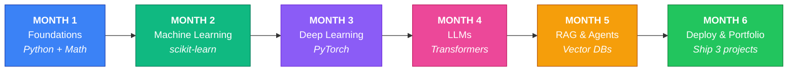
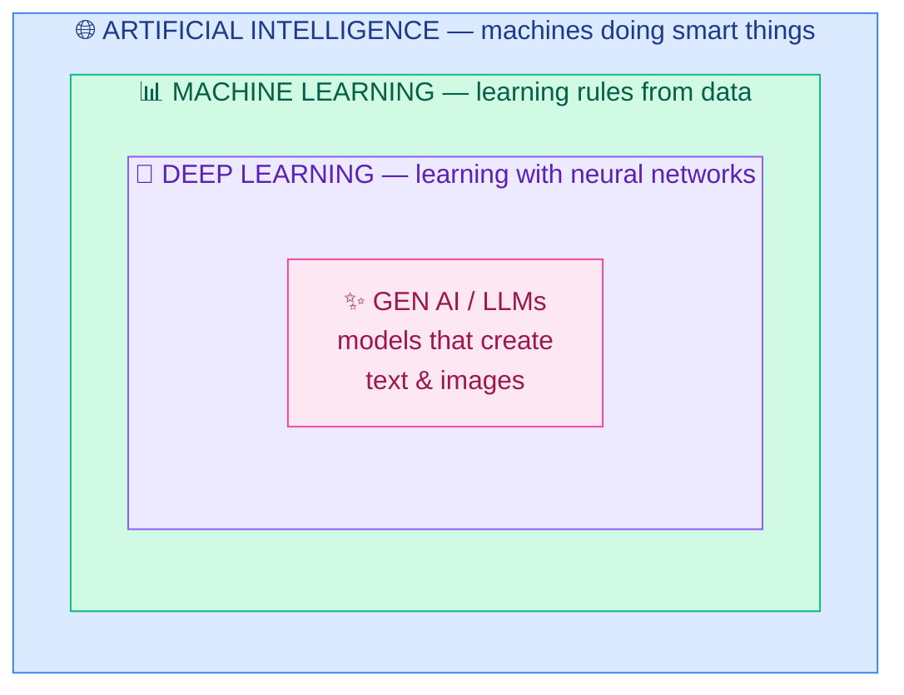
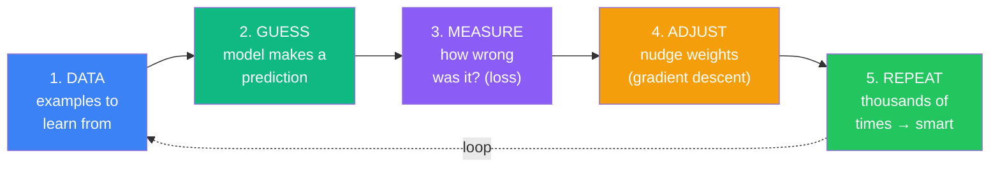
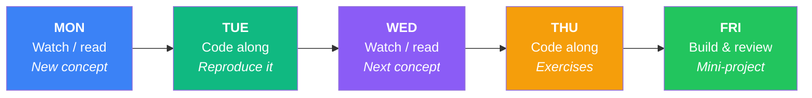
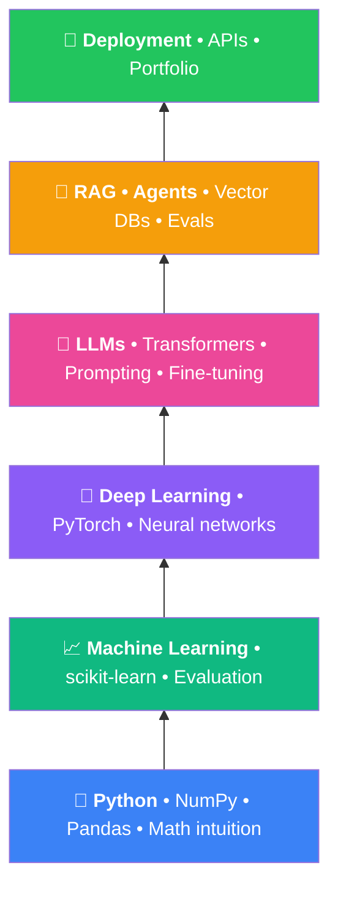
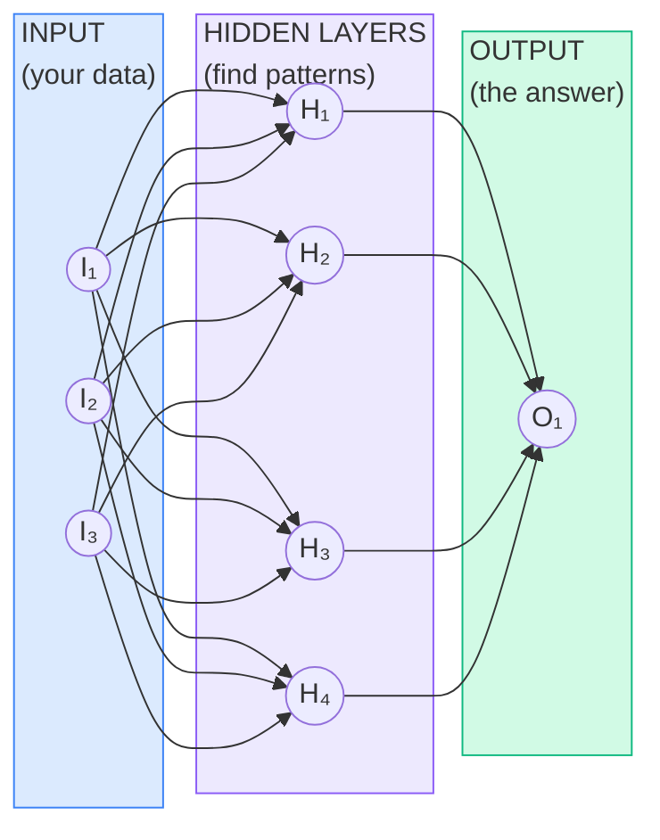
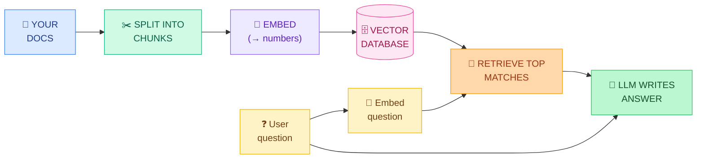

<div align="center">

# 🚀 The 6-Month AI Engineer Roadmap

### **From Python to production AI — in 26 weeks, for free.**

*A structured, project-first learning path for anyone who wants to become a hireable AI Engineer without paying a bootcamp $15k for what free resources already teach better.*

[](LICENSE)
[](https://github.com/anirudhpaka/ai-journey/stargazers)
[](https://github.com/anirudhpaka/ai-journey/network/members)
[](https://github.com/anirudhpaka/ai-journey/pulls)
[](README.md)
[](README.md)

**Foundations → Machine Learning → Deep Learning → LLMs → RAG & Agents → Deployment**

</div>



<div align="center">

| ⏱ **26 weeks** | 📅 **5 days/week** | ⚡ **1–2 hrs/day** | 🎯 **~200 hours total** | 🏆 **3 portfolio projects** |
|:---:|:---:|:---:|:---:|:---:|

</div>

> *"You do not need to be great to start. You need to start to become great."*

---

## 🎯 Who this is for

- **Career switchers** heading into AI Engineer / ML Engineer / Forward Deployed Engineer roles.
- **Software engineers** who want to add real AI skills, not just prompt engineering theater.
- **Students** who want a structured, project-first alternative to random YouTube rabbit holes.
- **Self-learners** who bounce off open-ended paths and need a clear *"do this next"* every week.

### What you need
✅ A laptop · ✅ Internet · ✅ 1–2 hours/day · ✅ Willingness to write code daily

### What you *don't* need
❌ Money — every resource here is free (Coursera: click "Audit") · ❌ A GPU — Google Colab is free · ❌ Prior AI experience — Week 1 starts at Python fundamentals · ❌ A CS degree

---

## ⚡ Quick start (60 seconds)

```bash
git clone https://github.com/anirudhpaka/ai-journey.git
cd ai-journey
```

Then, right now:

1. ⭐ **Star this repo** so you can find it. Star each of [these 8 GitHub curricula](#-github-learning-paths-star-them-all) too — they're the backbone of the roadmap.
2. 📅 **Block 1 hour/day, Mon–Fri** on your calendar. Protect it like a client meeting.
3. 🐍 **Open [kaggle.com/learn/python](https://kaggle.com/learn/python)** and start Lesson 1. Actually type the code.
4. 📓 **Fork this repo** and use it as your own progress tracker — check off items in the [weekly tracker](#-weekly-habit-tracker) as you go.

> 💡 **Full source doc:** [roadmap.pdf](roadmap.pdf) — the original visual roadmap this README is built from.

---

## 🧠 First: what even *is* AI?

Before any course, get the big picture. **"AI", "ML", "deep learning", and "LLMs" are not the same thing** — they are circles inside circles:



### The training loop *is* machine learning

Every AI model — from a linear regression to GPT — learns via this loop:



### Beginner dictionary (refer back anytime)

| Term | What it means (no jargon) |
|---|---|
| **Model** | The "brain": a math function with millions of adjustable numbers (weights) that turns input into output. |
| **Training** | Showing the model many examples and adjusting its weights until its guesses become good. |
| **Dataset** | The collection of examples used for training. Data quality matters more than fancy algorithms. |
| **Neural network** | A model built from layers of simple units. "Deep learning" just means many layers. |
| **LLM** | A giant neural network trained on huge amounts of text to predict the next word. GPT and Claude are LLMs. |
| **Token** | A piece of a word. LLMs read and write tokens, not letters. |
| **Prompt** | The instruction you give an LLM. Writing good prompts is a real engineering skill. |
| **Embedding** | Turning text into a list of numbers so a computer can measure "meaning similarity". |
| **RAG** | Retrieval-Augmented Generation: letting an LLM look up documents before answering. |
| **Agent** | An LLM in a loop that can use tools (search, code, APIs) to complete multi-step tasks. |
| **Fine-tuning** | Taking a trained model and training it more on your own examples to specialize it. |
| **Inference** | Using a trained model to get answers. Training = school; inference = the job. |

---

## 📐 How this roadmap works

Three non-negotiable rules:

| 🔄 Consistency beats intensity | 🔨 Build more than you watch | ✅ Done beats perfect |
|:---:|:---:|:---:|
| 1–2 focused hours, 5 days/week. Miss a week? Resume where you left off — never restart from Week 1. | Every "COMPLETE THIS" item is mandatory. Watching feels like progress; building **is** progress. | 80% understanding + a working project beats 100% theory with nothing built. If stuck 2 days, mark it and move on. |

### Weekly rhythm



**Weekends fully off.** Rest is part of the plan.

### The learning stack — never skip levels

AI is a stack, not a menu. Skipping layers is why most self-taught journeys fail.



### Every phase gives you 4 things

📋 **Week-by-week table** — what to learn, exact link, concrete completion checklist
🎨 **Easy mode box** — interactive W3Schools-style lessons for gentler on-ramps
🎯 **Milestone project** — what to push to GitHub at month end
✅ **Checkpoint** — questions to pass before moving on

---

## 🔵 Phase 1 — Foundations: Python & Math for AI
**Weeks 1–4 · ~30–35 hours · Month 1**

**Goal:** write Python confidently for data work (NumPy, Pandas, charts) and build *visual intuition* for the math behind AI. No textbook proofs — beautiful animations first, then immediately use the ideas in code.

| Wk | Topic | Resource | Complete this |
|---|---|---|---|
| 1 | Python for data work | [Kaggle Learn – Python](https://kaggle.com/learn/python) | All 7 lessons + exercises · VS Code + Jupyter installed · GitHub repo created |
| 2 | NumPy, Pandas, Matplotlib | [Kaggle Learn – Pandas](https://kaggle.com/learn/pandas) · [W3Schools NumPy](https://w3schools.com/python/numpy) | All 6 Pandas lessons · NumPy Intro → Array Slicing · Analyze 1 CSV: 10 questions, 5 charts |
| 3 | Linear algebra (visual) | [3Blue1Brown – Essence of Linear Algebra](https://3blue1brown.com/topics/linear-algebra) | Videos 1–7 · Recreate dot product + matrix transform in NumPy · 1-page notes |
| 4 | Calculus + statistics intuition | [3Blue1Brown Calculus](https://3blue1brown.com/topics/calculus) · [StatQuest](https://youtube.com/@statquest) | 4 calculus videos + 6 StatQuest videos · Code gradient descent from scratch (20 lines) |

> 🎨 **Easy mode:** [W3Schools Python](https://w3schools.com/python) · [NumPy](https://w3schools.com/python/numpy) · [Pandas](https://w3schools.com/python/pandas) · [Matplotlib](https://w3schools.com/python/matplotlib_intro.asp)

### 🎯 Milestone project — Data Explorer Notebook
Pick a Kaggle dataset that interests you (stocks, real estate, movies, sports). One polished notebook: **load → clean → explore → visualize → 5 insights in plain English**. Push it. This repo grows for all 6 months.

### ✅ Checkpoint — ready for Phase 2 when you can:
- [ ] Write a Python function and class without looking anything up
- [ ] Explain what matrix multiplication does to a vector (rotate/stretch space)
- [ ] Answer questions about a CSV using Pandas groupby and filtering
- [ ] Explain gradient descent in one sentence: *"follow the slope downhill to reduce error"*

---

## 🟢 Phase 2 — Machine Learning Fundamentals
**Weeks 5–8 · ~32–36 hours · Month 2**

**Goal:** understand how machines learn from data, train real models with scikit-learn, and learn to *evaluate* them honestly — the skill that separates engineers from tutorial-followers.

| Wk | Topic | Resource | Complete this |
|---|---|---|---|
| 5 | ML basics, regression, classification | [Microsoft ML-For-Beginners](https://github.com/microsoft/ML-For-Beginners) · [Google ML Crash Course](https://developers.google.com/machine-learning/crash-course) | Intro (1–4) + Regression (5–8) · Train linear + logistic regression |
| 6 | Trees, forests, gradient boosting | [Kaggle Intro to ML](https://kaggle.com/learn/intro-to-machine-learning) · [Intermediate ML](https://kaggle.com/learn/intermediate-machine-learning) | Both courses · Enter Kaggle Titanic, submit a score |
| 7 | Evaluation, overfitting, ROC | [StatQuest ML playlist](https://youtube.com/@statquest) · [scikit-learn User Guide](https://scikit-learn.org/stable/user_guide.html) | 8 StatQuest videos · Improve Titanic with CV + feature engineering |
| 8 | Clustering, PCA, end-to-end workflow | [ML-For-Beginners Clustering](https://github.com/microsoft/ML-For-Beginners) · [Andrew Ng ML Specialization (audit = free)](https://coursera.org/specializations/machine-learning-introduction) | Clustering lessons + quiz · Full pipeline on Kaggle House Prices |

> 🎨 **Easy mode:** [W3Schools ML](https://w3schools.com/python/python_ml_getting_started.asp) · [W3Schools AI](https://w3schools.com/ai)

### 🎯 Milestone project — End-to-End ML Project
Cleaned data · 2+ models compared · honest cross-validated evaluation · README explaining every choice. Post the story on LinkedIn — start building the AI brand early.

### ✅ Checkpoint — ready for Phase 3 when you can:
- [ ] Explain overfitting and two ways to fight it (more data, regularization, simpler model)
- [ ] Choose precision vs recall for a business case and justify it
- [ ] Train, tune, and compare two models in scikit-learn without a tutorial
- [ ] Score in the top half of the Titanic leaderboard

---

## 🟣 Phase 3 — Deep Learning & PyTorch
**Weeks 9–13 · ~40–45 hours · Month 3**

**Goal:** understand neural networks deeply enough to build one from scratch, then use PyTorch fluently. Every LLM is a neural network like this — just enormously bigger.

> ⚠️ **Rule for this month: type every line yourself. Never copy-paste.** Muscle memory > understanding.



Your guide this month: **Andrej Karpathy's "Neural Networks: Zero to Hero"** — free lectures by an OpenAI founding member, widely considered the best deep-learning material ever made.

| Wk | Topic | Resource | Complete this |
|---|---|---|---|
| 9 | What a neural network *is* | [3Blue1Brown Neural Networks](https://3blue1brown.com/topics/neural-networks) · [Microsoft AI-For-Beginners](https://github.com/microsoft/AI-For-Beginners) | All 4 core videos, twice · Trace one forward pass by hand |
| 10 | Backprop from scratch (micrograd) | [Karpathy Zero to Hero, video 1](https://karpathy.ai/zero-to-hero.html) | Full video typing along · Do the exercises |
| 11 | PyTorch tensors, autograd, training loop | [learnpytorch.io](https://learnpytorch.io) · [PyTorch tutorials](https://docs.pytorch.org/tutorials) | Chapters 00–03 · Train an MNIST classifier in Colab |
| 12 | CNNs + transfer learning | [fast.ai Practical DL](https://course.fast.ai) | Lessons 1–2 + notebooks · Fine-tune a pretrained model |
| 13 | Language begins (makemore) | [Karpathy Zero to Hero, videos 2–3](https://karpathy.ai/zero-to-hero.html) | Both videos typing along · Train makemore, generate names |

> 🎨 **Easy mode:** [W3Schools AI – Neural Networks](https://w3schools.com/ai/ai_neural_networks.asp) · [TensorFlow Playground](https://playground.tensorflow.org) — drag sliders, watch a neural net learn live

### 🎯 Milestone project — Image Classifier + Tiny Language Model
Publish: (1) fine-tuned image classifier with a demo GIF in the README, (2) your character-level language model with sample generations. You can now truthfully say: *"I built neural networks from scratch."*

### ✅ Checkpoint — ready for Phase 4 when you can:
- [ ] Tell the backprop story (chain rule + follow the gradient downhill)
- [ ] Write a PyTorch training loop from memory
- [ ] Explain embeddings
- [ ] Explain transfer learning

---

## 🌸 Phase 4 — LLMs & Transformers
**Weeks 14–17 · ~32–36 hours · Month 4**

**Goal:** understand how GPT-class models actually work (you will build one!), then get fluent with the modern LLM toolbox — Hugging Face, prompting, structured outputs, tool calling.

| Wk | Topic | Resource | Complete this |
|---|---|---|---|
| 14 | Transformer + attention (in 3D) | [LLM Visualization](https://bbycroft.net/llm) · [The Illustrated Transformer](https://jalammar.github.io/illustrated-transformer) | Full 3D walkthrough · Read essay twice · 1-page "how attention works" writeup |
| 15 | Build GPT from scratch | [Karpathy – Let's build GPT + Tokenizer](https://karpathy.ai/zero-to-hero.html) | Train mini-GPT on Shakespeare · Commit annotated code |
| 16 | Hugging Face + Ollama | [HF LLM Course](https://huggingface.co/learn) · [Ollama](https://ollama.com) | HF chapters 1–2 · 3 pipeline tasks · Chat with local Ollama model |
| 17 | Prompts, JSON output, tool calling | [Microsoft gen-ai-for-beginners](https://github.com/microsoft/generative-ai-for-beginners) · [Anthropic Courses](https://github.com/anthropics/courses) | Lessons 1–6 + quizzes · Build CLI assistant with tool calling |

> 🎨 **Easy mode:** [W3Schools Generative AI](https://w3schools.com/gen_ai) · [poloclub Transformer Explainer](https://poloclub.github.io/transformer-explainer)

### 🎯 Milestone project — "I Built GPT" + LLM Toolkit
Publish: trained mini-GPT with sample outputs + the tool-calling CLI assistant. Write the LinkedIn post: *"I built a GPT from scratch — here's what I learned about how LLMs really work."* Recruiters notice posts like this.

### ✅ Checkpoint — ready for Phase 5 when you can:
- [ ] Explain attention in plain English: *each word looks at other words and decides what matters*
- [ ] Explain tokens, context windows, temperature
- [ ] Get reliable JSON out of an LLM API with a system prompt
- [ ] State the difference between pretraining, fine-tuning, prompting

---

## 🟠 Phase 5 — RAG, Agents & AI Engineering
**Weeks 18–22 · ~40–45 hours · Month 5**

**Goal:** master the patterns companies actually hire for — RAG, agents, evaluation. Maps 1:1 onto AI Engineer and Forward Deployed Engineer job descriptions.

### How RAG works — study until you can redraw it from memory

> *Give the AI your documents so it answers from **facts**, not memory.*



| Wk | Topic | Resource | Complete this |
|---|---|---|---|
| 18 | Embeddings + vector search | [DeepLearning.AI – Embeddings & Vector DBs](https://deeplearning.ai/short-courses) | 2 short courses · Embed 50 docs into Chroma; run 10 semantic searches |
| 19 | RAG end-to-end | [DL.AI LangChain – Chat with Your Data](https://deeplearning.ai/short-courses) · [LangChain docs](https://python.langchain.com) | Course + quickstart · Build "chat with my PDFs" |
| 20 | Improving RAG + evals | [Ragas](https://github.com/explodinggradients/ragas) | Add reranking + 10-question eval set · Record before/after scores |
| 21 | Agents + tool use + MCP | [Microsoft gen-ai-for-beginners](https://github.com/microsoft/generative-ai-for-beginners) · [MCP docs](https://modelcontextprotocol.io) | Agent lessons + quizzes · Build agent with 2+ tools |
| 22 | Streaming, caching, guardrails | [Hamel Husain – Your AI product needs evals](https://hamel.dev) | Read essay · Add streaming, error handling, eval suite |

### 🎯 Milestone project — Production-Style RAG + Agent App (flagship)
One serious application: document Q&A with citations · agent mode with tools · eval suite · clean UI. **This is the #1 interview project.** Pick a domain you care about (legal, medical notes, real-estate research, your own PDFs).

### ✅ Checkpoint — ready for Phase 6 when you can:
- [ ] Redraw the RAG pipeline above from memory in 2 minutes
- [ ] Name 3 reasons a RAG system answers wrongly, with a fix for each
- [ ] Explain what makes something an "agent" vs a chatbot (loop + tools + goal)
- [ ] Describe how you would evaluate an LLM app before shipping

---

## 🟩 Phase 6 — Deploy, Portfolio & Interview Prep
**Weeks 23–26 · ~30–34 hours · Month 6**

**Goal:** turn skills into evidence. Ship projects publicly, polish GitHub and resume, prep for AI Engineer / FDE interviews.

| Wk | Topic | Resource | Complete this |
|---|---|---|---|
| 23 | FastAPI + Docker | [FastAPI tutorial](https://fastapi.tiangolo.com) · [Docker Get Started](https://docker.com/get-started) | Tutorial parts 1–10 · Wrap RAG app in API + containerize |
| 24 | Deploy publicly | [HF Spaces](https://huggingface.co/spaces) · [Vercel](https://vercel.com) | Public URL live · Add URL to resume |
| 25 | Portfolio polish | [readme.so](https://readme.so) · [Excalidraw](https://excalidraw.com) | 3 pinned repos with diagram + demo + writeup · 2 published posts |
| 26 | Interviews | [ML Interviews study guide](https://github.com/alirezadir/Machine-Learning-Interviews) · [deep-ml.com](https://deep-ml.com) | 20 practice questions answered aloud · 2 mock interviews · 10 tailored applications |

### 🎯 Milestone project — 🎓 Graduation: The Job-Ready Package
By end of Week 26: **3 deployed projects with public URLs · a GitHub that tells a 6-month story · 2 technical posts · an AI-focused resume · practiced interview answers.**

That is not "learning AI" — that is **being an AI engineer.**

---

## 📚 GitHub learning paths (star them all)

These are the best free curricula on GitHub. The roadmap above already weaves them into your weeks — this table tells you *exactly* which parts to complete and when.

| Repo | What it is | Use it for |
|---|---|---|
| [microsoft/ML-For-Beginners](https://github.com/microsoft/ML-For-Beginners) | 26 lessons on classic ML, quizzes, sketchnotes | **Phase 2 backbone** (Weeks 5–8) |
| [microsoft/AI-For-Beginners](https://github.com/microsoft/AI-For-Beginners) | 24 lessons on neural nets, CV, NLP | **Phase 3** (Weeks 9–12) |
| [karpathy/nn-zero-to-hero](https://github.com/karpathy/nn-zero-to-hero) | micrograd, makemore, build-GPT notebooks | **Weeks 10, 13, 15** |
| [microsoft/generative-ai-for-beginners](https://github.com/microsoft/generative-ai-for-beginners) | 21 lessons on GenAI apps, RAG, agents | **Weeks 17, 19–21** |
| [mlabonne/llm-course](https://github.com/mlabonne/llm-course) | Most-starred LLM roadmap on GitHub | **Phase 5 map** — skim + fill gaps |
| [rasbt/LLMs-from-scratch](https://github.com/rasbt/LLMs-from-scratch) | Build ChatGPT-style model in PyTorch | Optional deep-dive after Week 15 |
| [roadmap.sh/ai-engineer](https://roadmap.sh/ai-engineer) | Interactive community skill-tree | Monthly gap-check |
| [armankhondker/awesome-ai-ml-resources](https://github.com/armankhondker/awesome-ai-ml-resources) | Curated roadmap + resource list | Alternative explanations |

### Interactive websites that make concepts click

| Site | For |
|---|---|
| [W3Schools Python/NumPy/Pandas/ML/AI](https://w3schools.com/python) | Short pages + "Try it Yourself" editors |
| [Kaggle Learn](https://kaggle.com/learn) | Auto-checked micro-courses in the browser |
| [TensorFlow Playground](https://playground.tensorflow.org) | Watch a neural net learn live |
| [LLM Visualization](https://bbycroft.net/llm) | 3D animated GPT you can walk through |
| [Google ML Crash Course](https://developers.google.com/machine-learning/crash-course) | Interactive second-explanation for anything unclear |

---

## 💭 FAQ — your fears, answered honestly

<details>
<summary><b>"Will I really be able to complete this?"</b></summary>

**Yes — if you protect the daily slot.** ~200 hours over 26 weeks. The only failure mode is stopping. Miss a week? Resume where you left off. **Never restart from Week 1.**
</details>

<details>
<summary><b>"Will I be an AI expert in 6 months?"</b></summary>

**Honest answer:** you'll be a **competent, hireable AI engineer** — able to build, evaluate, and deploy real AI systems and speak about them credibly. "Answer anything" expertise takes years for everyone. Six months gets you to the level where you learn the rest **on the job** — which is how every expert actually got there.
</details>

<details>
<summary><b>"What if I get stuck?"</b></summary>

**Rule of three:** (1) re-watch at 0.75x speed, (2) ask an LLM to explain with an analogy and quiz you, (3) still stuck after 2 days → mark it, move on. Later material often makes earlier material click.
</details>

<details>
<summary><b>"Do I need money or a GPU?"</b></summary>

**No.** Colab gives free GPUs. Every course here is free or free-to-audit (on Coursera click Enroll → "Audit"). Optional: $5–10 of API credits in Phases 4–5; free tiers usually cover it.
</details>

<details>
<summary><b>"Is math going to block me?"</b></summary>

**You need intuition, not proofs.** 3Blue1Brown gives you pictures; the code gives you practice. If you can follow *"slope tells you which way is downhill,"* you can follow deep learning.
</details>

<details>
<summary><b>"What exactly is a Forward Deployed Engineer (FDE)?"</b></summary>

An engineer who sits with customers and builds AI solutions on **their real data and workflows** — half builder, half consultant. Companies like Palantir, Anthropic, OpenAI, and Scale hire heavily for this role. Consulting background + this roadmap = a strong FDE profile.
</details>

<details>
<summary><b>"Can I speed it up? Slow it down?"</b></summary>

**Speed up:** if you have 3+ hrs/day and prior coding experience, compress to 3–4 months. Don't skip milestone projects — they're the résumé. **Slow down:** if life gets busy, drop to 3 days/week and stretch to 9 months. **Consistency > pace.**
</details>

<details>
<summary><b>"I already know Python / ML. Where do I start?"</b></summary>

Skip to the phase where you'd fail the checkpoint. Most people with backend experience but no AI start at **Phase 3**. People with classical ML experience but no LLM work start at **Phase 4**.
</details>

---

## 📊 Weekly habit tracker

Fork this repo and check off boxes as you go. Miss a week? **Do not restart** — pick up where you left off.

| Wk | M | T | W | T | F | Built something? | Note to self |
|---|---|---|---|---|---|---|---|
| 1 | ☐ | ☐ | ☐ | ☐ | ☐ | | |
| 2 | ☐ | ☐ | ☐ | ☐ | ☐ | | |
| 3 | ☐ | ☐ | ☐ | ☐ | ☐ | | |
| 4 | ☐ | ☐ | ☐ | ☐ | ☐ | | |
| 5 | ☐ | ☐ | ☐ | ☐ | ☐ | | |
| 6 | ☐ | ☐ | ☐ | ☐ | ☐ | | |
| 7 | ☐ | ☐ | ☐ | ☐ | ☐ | | |
| 8 | ☐ | ☐ | ☐ | ☐ | ☐ | | |
| 9 | ☐ | ☐ | ☐ | ☐ | ☐ | | |
| 10 | ☐ | ☐ | ☐ | ☐ | ☐ | | |
| 11 | ☐ | ☐ | ☐ | ☐ | ☐ | | |
| 12 | ☐ | ☐ | ☐ | ☐ | ☐ | | |
| 13 | ☐ | ☐ | ☐ | ☐ | ☐ | | |
| 14 | ☐ | ☐ | ☐ | ☐ | ☐ | | |
| 15 | ☐ | ☐ | ☐ | ☐ | ☐ | | |
| 16 | ☐ | ☐ | ☐ | ☐ | ☐ | | |
| 17 | ☐ | ☐ | ☐ | ☐ | ☐ | | |
| 18 | ☐ | ☐ | ☐ | ☐ | ☐ | | |
| 19 | ☐ | ☐ | ☐ | ☐ | ☐ | | |
| 20 | ☐ | ☐ | ☐ | ☐ | ☐ | | |
| 21 | ☐ | ☐ | ☐ | ☐ | ☐ | | |
| 22 | ☐ | ☐ | ☐ | ☐ | ☐ | | |
| 23 | ☐ | ☐ | ☐ | ☐ | ☐ | | |
| 24 | ☐ | ☐ | ☐ | ☐ | ☐ | | |
| 25 | ☐ | ☐ | ☐ | ☐ | ☐ | | |
| 26 | ☐ | ☐ | ☐ | ☐ | ☐ | | |

---

## 🗂 Suggested repo layout

As you progress, structure your fork like this. Each phase folder holds that month's notebooks and milestone project.

```
ai-journey/
├── phase-1-foundations/     # Data Explorer Notebook
├── phase-2-ml/              # End-to-End ML Project
├── phase-3-deep-learning/   # Image Classifier + Tiny LM
├── phase-4-llms/            # Mini-GPT + Tool-calling CLI
├── phase-5-rag-agents/      # Flagship RAG + Agent App
├── phase-6-deploy/          # Dockerfile, deploy configs
├── roadmap.pdf              # The original source document
├── LICENSE
└── README.md
```

---

## 🤝 Contributing

Found a broken link? A better resource? A clearer explanation? **PRs welcome.**

- 🐛 [Open an issue](https://github.com/anirudhpaka/ai-journey/issues) for broken links, outdated resources, or suggestions
- ⭐ **Star the repo** to help others find it
- 🍴 **Fork it** and track your own progress publicly — recruiters love to see the arc
- 🐦 Share your milestone projects with `#AIJourney` — help build the community

---

## 📜 License

[MIT](LICENSE) — use this, remix it, teach with it. Attribution appreciated but not required.

---

<div align="center">

**⚡ The person who finishes this roadmap is not the person who started it. Begin.**

*If this helped, star the repo — it takes one click and helps the next learner find it.*

</div>
